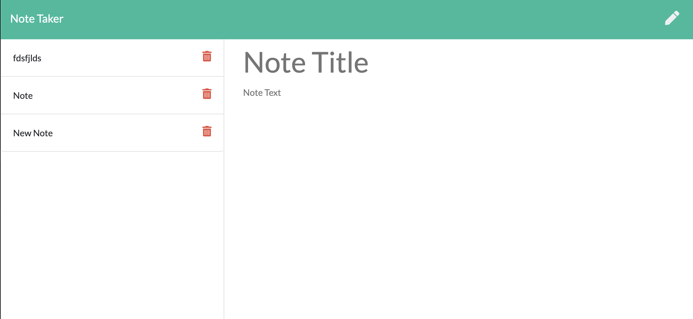

# Note Taker

## Description 

This project is a note taker application which uses express to write and save notes. Previous notes can also easily be viewed and deleted.

## Table of Contents

    * [Installation](#installation)
    * [Usage](#usage)
    * [Credits](#credits)
    * [License](#license)

## Installation

Simply npm install and then run npm start to deploye the server!

## Usage 

You can use npm start or npm run watch which will automatically update as you save with nodemon.

## License

## Badges

 

## Tests

NA

---

